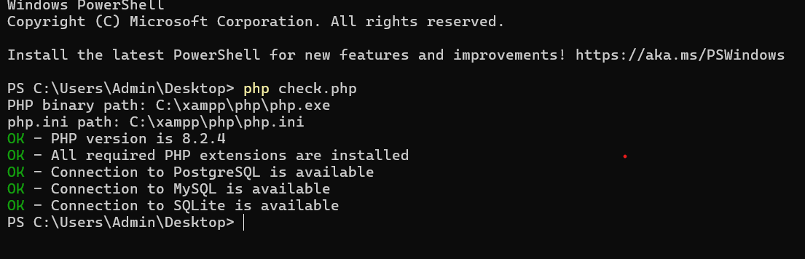

## Laravel Fundamental


---

### `01` - Install PHP & Composer & Laravel

1. **Install `PHP`**

- Install [XAMPP](https://www.apachefriends.org).
- Sau khi install và cài xong, add path `XAMPP` vào `Environment của Window`.

- Sau đó check version: `php -v`
- Check thêm config `PHP`: Tạo 1 file từ `check.php` và chạy nó (`php check.php`) cho đến khi **OK** hết mới thôi.
- Nếu chưa **OK**, vào file `php.ini` để turn on lên.


2. **Install `composer`**

[Composer](https://getcomposer.org/)

- Vào download và install nó.

3. **Install `Laravel`**

```bash
composer create-project laravel/laravel <example-app>
```

4. **`Run Project`**

```bash
php artisan serve
```

---

### `02` - Laravel Structure

