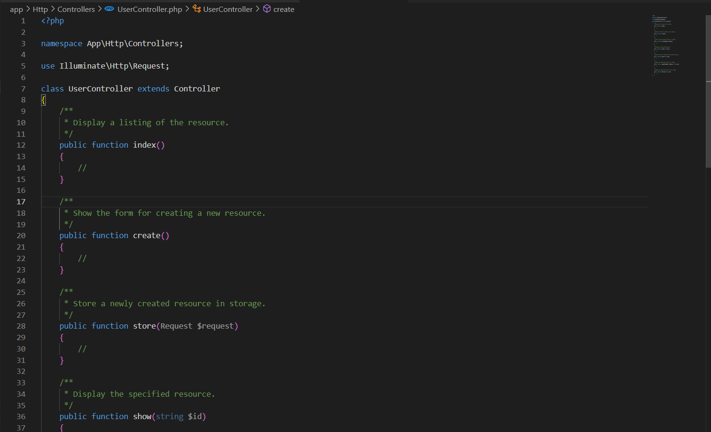

## Controller

---

### `01` - Create Controller

> **Command**: `php artisan make:controller NameController`

- **Controller**

```php
<?php

namespace App\Http\Controllers;

use Illuminate\Http\Request;

class PostController extends Controller
{
    protected $posts = [
        [
            'id' => 1,
            'title' => 'Post 2',
        ]
    ];

    public function index()
    {
        return response()->json($this->posts);
    }

    public function show()
    {
        return response()->json(['title' => 'Post detail']);
    }
}
```

- **Import Controller to Route**:

```php
use App\Http\Controllers\PostController;

Route::get('/posts', [PostController::class, 'index'])
```

---

### `02` - Invoke Action Controller

> **Command**: `php artisan make:controller <name_controller> --invokable`

- Tức là controller đó `chỉ sử dụng 1 action duy nhất` và import vào route **KHÔNG CẦN FILL NAME Method của Class VÀO** như `index, show,...`.

```php
class HelloWorldController extends Controller {
    public class __invoke() {
        return 'Hello world';
    }
}
```

- **Import to Route**:

```php
Route::get('/hello-world', HelloWorldController::class);
```

---

### `03` - Resource Controller

> `php artisan make:controller PostController --resource`

- **Resource**: Nó là `"nguồn"`, **tức là** nó sẽ tạo ra những method cho controller **CRUD** (`index`, `create`, `store`, `show`, `edit`, `update`, `destroy`). Và bạn chỉ cần import class vào route.




```php
Route::resource('/posts', PostController::class);

// 📌 `only` method: Partial Resource
Route::resource('/posts', PostController::class)->only(['index', 'show']);

// 📌 except method: Partial Resource
Route::resource('/posts', PostController::class)->except(['index', 'show']);
```