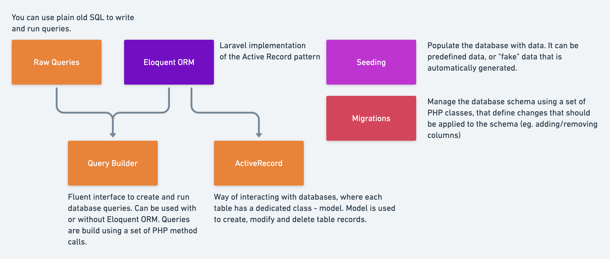

## Database



- [Database](#database)
  - [`01` - Migrations](#01---migrations)
  - [`02` - Seeding](#02---seeding)

---

### `01` - Migrations


- **Migrations**: Cho phép bạn có thể define và share data schema.

- **Command create model + migration**: Nó sẽ create **model** và **migration file**.
```bash
php artisan make:model Post -m
# -m: migration
```

- Bạn có thể tạo **file migration riêng**:
```bash
php artisan make:migration update_posts_table
# 📌 <method(create_update)-name_table-table-text>
```

- Method `up` và `down`:
  - `up`: dùng để apply `change` or `create` data schema.
  - `down`: dùng để `rollback change` data schema.

- **Class**:
  - **Schema class**: dùng để `create`, `modify` table.
  - **Blueprint class**: dùng để `create`, `modify` column table.

- **Migration Structure**:

```php
<?php
 
use Illuminate\Database\Migrations\Migration;
use Illuminate\Database\Schema\Blueprint;
use Illuminate\Support\Facades\Schema;
 
class CreatePostsTable extends Migration
{
    /**
     * Run the migrations.
     *
     * @return void
     */
    public function up()
    {
        Schema::create('posts', function (Blueprint $table) {
            $table->id();
            $table->string('title');
            $table->text('description');
            $table->timestamps();
        });
    }
 
    /**
     * Reverse the migrations.
     *
     * @return void
     */
    public function down()
    {
        Schema::drop('posts');
    }
}
```

- **Command run Migration & Rollback**:

```bash
# 📌 run change data schema
php artisan migrate

# 📌 rollback data schema
php artisan migrate:rollback
php artisan migrate:rollback --step=5 # run with step
php artisan migrate:reset # rollback all migrations

# 📌 refresh database and run all database seed
php artisan migrate:refresh --seed

# 📌 drop all table & migrate data
php artisan migrate:fresh
php artisan migrate:fresh --seed # additional -> seed data
```

---

### `02` - Seeding

- **Seeder**: Dùng để add init data vào table, database.

- **Command crete file**:

```bash
php artisan make:seeder PostSeeder
```

- **Code file seeder**:

```php
<?php
 
namespace Database\Seeders;
 
use Illuminate\Database\Seeder;
use Illuminate\Support\Facades\DB;
use Illuminate\Support\Facades\Hash;
use Illuminate\Support\Str;
use Carbon\Carbon;
 
class PostSeeder extends Seeder
{
    /**
     * Run the database seeders.
     */
    public function run(): void
    {
        DB::table('posts')->insert([
            [
                'title' => Str::random(10),
                'description' => Str::random(150),
                'created_at' => Carbon::now(),
                'updated_at' => Carbon::now(),
            ]
        ]);
    }
}
```

- Sau đó, add file seeder vào **DatabaseSeeder**.

```php
<?php

namespace Database\Seeders;

use App\Models\User;
// use Illuminate\Database\Console\Seeds\WithoutModelEvents;
use Illuminate\Database\Seeder;

class DatabaseSeeder extends Seeder
{
    /**
     * Seed the application's database.
     */
    public function run(): void
    {
        $this->call([ // 📌 add file seeder vào
            PostSeeder::class,
        ]);
    }
}

```

- **Command run Seeder**:

```bash
php artisan db:seed

# 📌 run theo file
php artisan db:seed --class=PostSeeder
```
