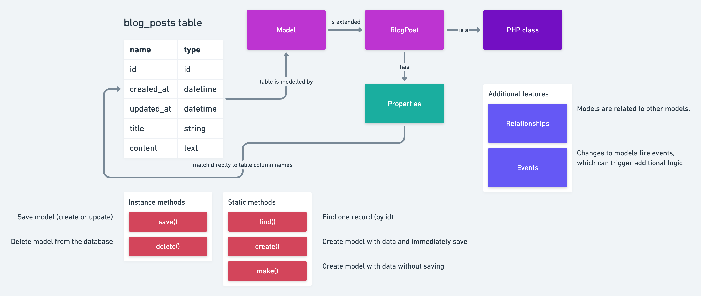

## Eloquent ORM



---

### `01` - CRUD

1. **`Find All`**

```php
<Model>::all()
```

2. **Pagination**

> [https://laravel.com/docs/11.x/pagination](https://laravel.com/docs/11.x/pagination)

```php
public function index(Request $request)
{
    $page = (int)$request->query('page', 1);
    $perPage = (int)$request->query('limit', 2);
    $posts = Post::query()->paginate($perPage, ['*'], 'page', $page); // 📌 use pagination

    $total = $posts->total();
    $data = $posts->items();
    $currentPage = $posts->currentPage();
    $lastPage = $posts->lastPage();
    $nextPage = $currentPage >= $lastPage ? null : $currentPage + 1;
    return response()->json([
        'data' => $data,
        'currentPage' => $currentPage,
        'nextPage' => $nextPage,
        'total' => $total,
    ]);
}
```

3. **`Find`**

```php
<Model>::find($id);
```

4. **`Create Data (Insert)`**

```php
Post::create($request->input()); // 📌 create
// 📌 auto remove những field mà không tồn tại trong table
```

5. **`Update`**

```php
$post = Post::find($id);
if (empty($post)) {
    return response()->json([
        'status' => 404,
        'error' => 'Not found this post'
    ]);
}

$post->update($request->input());
```

6. **`Delete`**

```php
$post = Post::find($id);
if (empty($post)) {
    return response()->json([
        'status' => 404,
        'error' => 'Not found this post to delete'
    ], 404);
}

$post->delete();
```